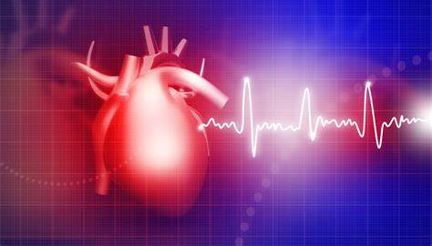

# Heart Disease Prediction 

### Introduction:

Heart disease describes a range of conditions that affect your heart. Diseases under the heart disease umbrella include blood vessel diseases, such as coronary artery disease; heart rhythm problems (arrhythmias); and heart defects you're born with (congenital heart defects), among others
The term "heart disease" is often used interchangeably with the term "cardiovascular disease." Cardiovascular disease generally refers to conditions that involve narrowed or blocked blood vessels that can lead to a heart attack, chest pain (angina) or stroke. Other heart conditions, such as those that affect your heart's muscle, valves or rhythm, also are considered forms of heart disease.

### Symptoms :

Heart disease symptoms depend on what type of heart disease you have.

Symptoms of heart disease in your blood vessels (atherosclerotic disease)
Cardiovascular disease symptoms may be different for men and women. For instance, men are more likely to have chest pain; women are more likely to have other symptoms along with chest discomfort, such as shortness of breath, nausea and extreme fatigue.

Symptoms can include:

* Chest pain, chest tightness, chest pressure and chest discomfort (angina)
* Shortness of breath
* Pain, numbness, weakness or coldness in your legs or arms if the blood vessels in those parts of your body are narrowed
* Pain in the neck, jaw, throat, upper abdomen or back

You might not be diagnosed with cardiovascular disease until you have a heart attack, angina, stroke or heart failure. It's important to watch for cardiovascular symptoms and discuss concerns with your doctor. Cardiovascular disease can sometimes be found early with regular evaluations.
